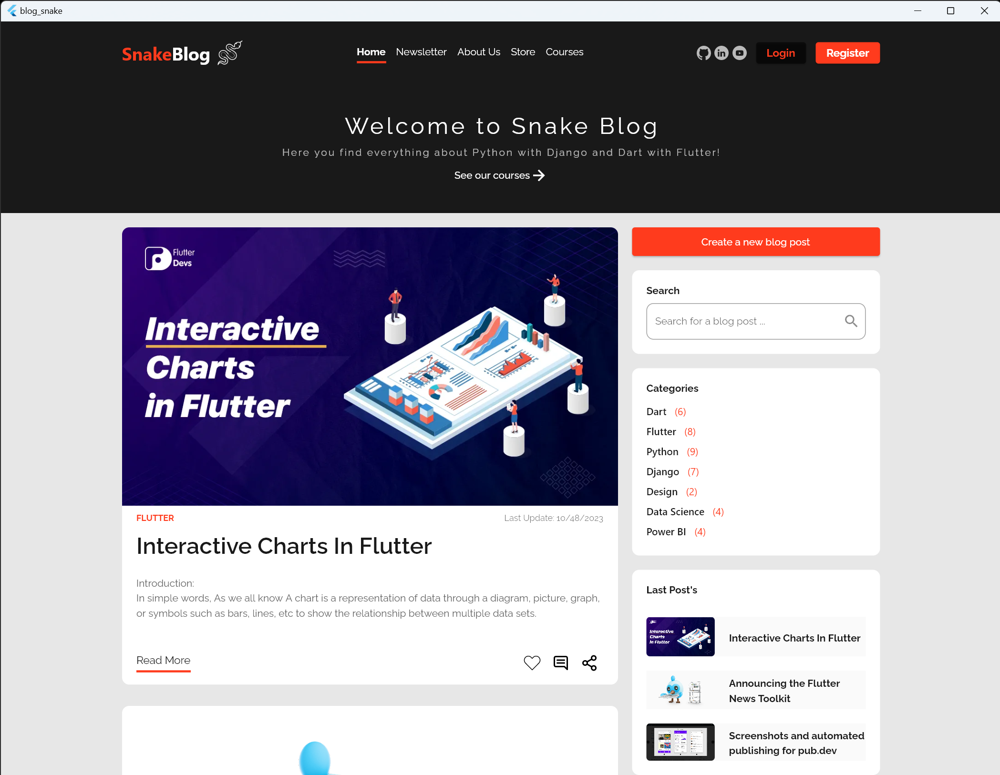

SnakeBlog is a blogging platform built with Flutter and Django that allows users to create and share their posts. It features a modern, responsive design that allows users to easily access their posts from any device and a powerful backend, developed in Django, that makes administrating posts easy.

## Image


Other images can be found [here](./github/assets/)

## Features

* Login and registration
* Post creation, deletion, updating, and reading
* Responsive design
* Easy to use administration

## Getting Started

To get started with SnakeBlog, you'll need to install the necessary dependencies.

### Prerequisites

* [Flutter](https://flutter.dev/)
* [API Django](https://github.com/imklesley/snakeblog-django.git)

### Installation

First, clone the repository [API Django](https://github.com/imklesley/BlogInDjango) and follow the steps on the README.md .

Then, clone this repository:

```
git clone https://github.com/imklesley/snakeblog-flutter.git
```

Now, you have to rename the file named **.env-example** to **.env** and change the BASE_URL value to your api address.

To download the Flutter dependencies, you need to run a command in the terminal from within the project folder:
```
flutter pub get
```

After that, you can run the application by navigating to the project directory and running:

```
flutter run
```

*MAKE SURE THAT YOUR DJANGO API ITS RUNNING ON A DIFFERENT ADDRESS AND PORT THAT YOUR FLUTTER APPLICATION!*


## Usage

When you first open the application, you will be taken to the login page. If you don't have an account yet, you can click the "Register" button to create a new account.

Once you are logged in, you will be taken to the main page where you can view posts from other users and create your own. To create a new post, click the "+" button in the bottom right corner of the screen.

You can also view your own posts by clicking the "My Posts" button in the top right corner of the screen. This will take you to a page where you can view, edit, and delete your posts.

## API

The backend for SnakeBlog is powered by a Django/Python API. You can find the repository for this API [here](https://github.com/imklesley/snakeblog-django.git).


##

<p align="center">Developed by <span color="#007DFF" >Klesley Gonçalves</span></p>